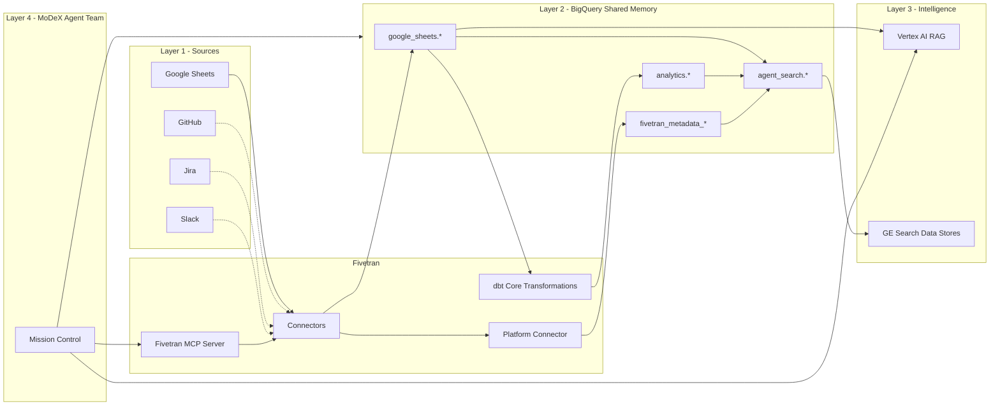
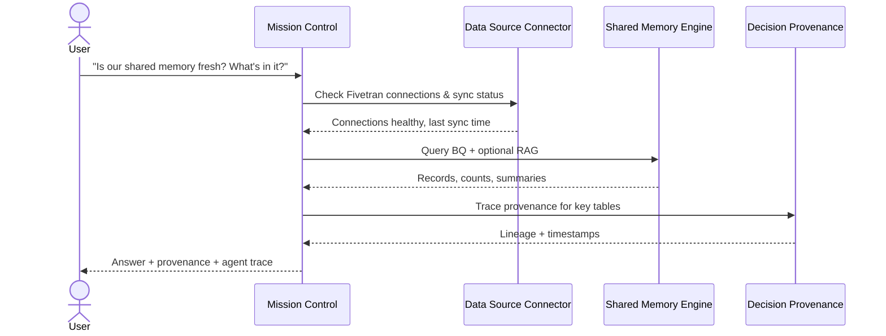
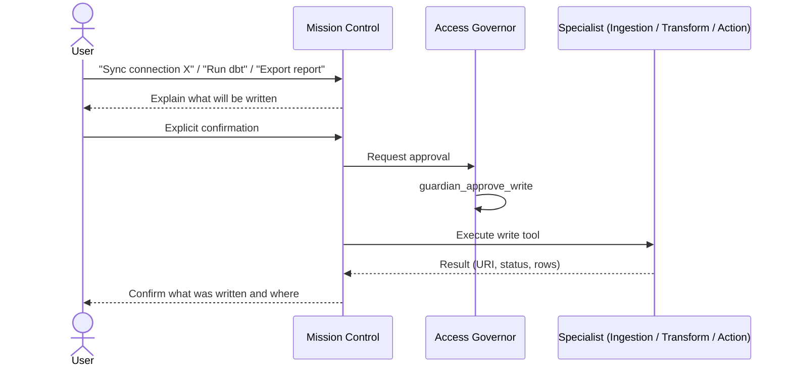
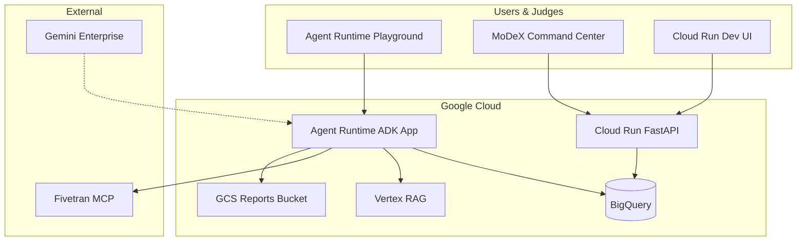

# MoDeX Architecture Reference

> **MoDeX** = **Memory of Codex** — shared reasoning memory for engineering teams using AI coding agents.

Use this document as your mental map: what MoDeX is, how layers connect, which agent does what, and how a mission flows end-to-end.

**Build tracker:** see `BUILD_STAGES.md` for stage-by-stage progress and consultation log.

---

## 0. Two-Face System (primary mental model)

MoDeX is **two faces** around a **Fivetran + BigQuery** bus:

```
FACE 1 — Developer edge (MCP in Cursor / Antigravity / Windsurf)
  WRITE: append_codebase_log (primary) — session_start, tool_call, file_edit, decision, error, session_end
  READ:  load_context_from_logs — replay append-only events to hydrate NEW agent at session start
  Store: agent_memory.codebase_logs (source of truth) + optional Sheet mirror for Fivetran

         ───────────── Fivetran pipelines + BQ warehouse ─────────────

FACE 2 — Platform (7 ADK agents + Command Center)
  Query memory, pipeline health, lineage, dbt, governed exports
  Playground + /dashboard/ for team leads and ops
```

| Face | Who uses it | Package / surface |
|------|-------------|-------------------|
| **Face 1** | Developers in IDE | `modex_mcp/` — see `modex_mcp/README.md` |
| **Face 2** | Team / judges / ops | `app/` agents + `frontend/` dashboard |

**Session handoff:** Dev A ends Cursor → `save_session_memory` → Dev B starts Antigravity → `load_team_context` → same context, no cold start.

---

## 1. Core Idea (one paragraph)

Engineering teams run many isolated AI coding agents (Cursor, Antigravity, Windsurf). Each session starts from zero — no shared memory of **why** decisions were made. MoDeX fixes that by:

1. **Ingesting** team data (GitHub, Sheets, Jira, Slack…) via **Fivetran**
2. **Storing** it in **BigQuery** as queryable shared memory
3. **Searching** it with **SQL + RAG**
4. **Tracing** freshness and lineage via **Fivetran Platform Connector metadata**
5. **Structuring** raw data into analytics tables via **dbt**
6. **Broadcasting** insights back to the team (GCS, Sheets, webhooks)
7. **Governing** all writes through a **Guardian** gate

---

## 2. Conceptual Stack (5 layers)

```
┌─────────────────────────────────────────────────────────────────┐
│  LAYER 5 — CONSUMPTION                                          │
│  Individual AI coding agents · MoDeX Playground · Dashboard UI  │
└───────────────────────────────┬─────────────────────────────────┘
                                │ natural language missions
┌───────────────────────────────▼─────────────────────────────────┐
│  LAYER 4 — AGENT TEAM (Google ADK, Gemini)                      │
│  Mission Control + 6 specialists (orchestration & reasoning)    │
└───────────────────────────────┬─────────────────────────────────┘
                                │ tools (MCP, SQL, RAG, actions)
┌───────────────────────────────▼─────────────────────────────────┐
│  LAYER 3 — INTELLIGENCE SERVICES                                │
│  Fivetran MCP · BigQuery · Vertex RAG · GE Search · Guardian    │
└───────────────────────────────┬─────────────────────────────────┘
                                │ sync / query / index
┌───────────────────────────────▼─────────────────────────────────┐
│  LAYER 2 — SHARED MEMORY WAREHOUSE                              │
│  BigQuery: raw tables · analytics.* · metadata · search views   │
└───────────────────────────────┬─────────────────────────────────┘
                                │ connectors
┌───────────────────────────────▼─────────────────────────────────┐
│  LAYER 1 — ENGINEERING DATA SOURCES                             │
│  GitHub · Google Sheets · Jira · Slack · Notion · 750+ more     │
└─────────────────────────────────────────────────────────────────┘
```

| Layer | MoDeX name | What it answers |
|-------|------------|-----------------|
| 1 | **Sources** | Where does team knowledge live today? |
| 2 | **Shared Memory Warehouse** | Where is it centralized and queryable? |
| 3 | **Intelligence Services** | How do agents read, search, and operate pipelines? |
| 4 | **Agent Team** | Who plans, delegates, and synthesizes answers? |
| 5 | **Consumption** | How do humans and coding agents interact? |

---

## 3. Agent Team (7 agents)

MoDeX is implemented as one **orchestrator** plus **six specialists**. The orchestrator never calls tools directly — it delegates.

```
                    ┌─────────────────────┐
                    │   Mission Control   │
                    │  orchestrator_agent │
                    │   (no direct tools) │
                    └──────────┬──────────┘
           ┌─────────┬─────────┼─────────┬─────────┬─────────┐
           ▼         ▼         ▼         ▼         ▼         ▼
    ┌──────────┐ ┌──────────┐ ┌──────────┐ ┌──────────┐ ┌──────────┐ ┌──────────┐
    │  Data    │ │  Shared  │ │ Decision │ │Knowledge │ │   Team   │ │  Access  │
    │  Source  │ │  Memory  │ │Provenance│ │Structurer│ │Broadcaster│ │ Governor │
    │Connector │ │  Engine  │ │          │ │          │ │          │ │          │
    └──────────┘ └──────────┘ └──────────┘ └──────────┘ └──────────┘ └──────────┘
```

### 3.1 Agent reference table

| Code ID | MoDeX persona | Job | Tools (count) |
|---------|---------------|-----|---------------|
| `orchestrator_agent` | **Mission Control** | Plan missions, delegate, summarize with provenance | 0 (delegation only) |
| `ingestion_agent` | **Data Source Connector** | Pipeline health, list connections, trigger syncs | 6 |
| `knowledge_agent` | **Shared Memory Engine** | Query BQ + semantic RAG search | 4 |
| `lineage_agent` | **Decision Provenance** | Freshness, sync history, lineage, schema changes | 3 |
| `transformation_agent` | **Knowledge Structurer** | dbt project status, run transformations | 7 |
| `action_agent` | **Team Broadcaster** | Reports → GCS / Sheets / webhooks | 5 |
| `guardian_agent` | **Access Governor** | Approve or deny all writes | 2 |

**Source files:** `app/agent.py` (orchestrator), `app/specialists.py` (specialists)

### 3.2 When to delegate (decision guide)

| User intent | Delegate to | Example question |
|-------------|-------------|------------------|
| "Are pipelines healthy / synced?" | Data Source Connector | "Is our Sheets connection syncing?" |
| "What does the team know / count / list?" | Shared Memory Engine | "How many records in shared memory?" |
| "What does X mean conceptually?" | Shared Memory Engine (RAG) | "What is decision provenance?" |
| "When was data last synced / where from?" | Decision Provenance | "Trace codebase_logs back to source" |
| "What dbt models exist / run transform?" | Knowledge Structurer | "What analytics tables does dbt produce?" |
| "Export / push / notify the team" | Team Broadcaster | "Export standup summary to GCS" |
| Any **write** (sync, dbt run, export) | Access Governor **first** | User must explicitly confirm |

### 3.3 Tool inventory by agent

#### Data Source Connector (`ingestion_agent`)
| Tool | Type | Purpose |
|------|------|---------|
| `fivetran_get_account_info` | MCP read | Account overview |
| `fivetran_list_groups` | MCP read | List Fivetran groups |
| `fivetran_list_destinations` | MCP read | List destinations |
| `fivetran_list_connections` | MCP read | List connections in a group |
| `fivetran_get_connection_details` | MCP read | Connection status & sync state |
| `fivetran_sync_connection` | MCP **write** | Trigger sync (Guardian required) |

#### Shared Memory Engine (`knowledge_agent`)
| Tool | Type | Purpose |
|------|------|---------|
| `get_data_catalog` | BQ read | Discover datasets/tables across warehouse |
| `get_table_schema` | BQ read | Column definitions for a table |
| `query_bigquery` | BQ read | SELECT-only SQL on shared memory |
| `search_knowledge_base` | RAG read | Semantic search over `knowledge/data_dictionary.md` |

#### Decision Provenance (`lineage_agent`)
| Tool | Type | Purpose |
|------|------|---------|
| `get_pipeline_metadata_catalog` | BQ read | List Platform Connector metadata tables |
| `query_bigquery` | BQ read | Query `log`, `connection`, `table_lineage`, etc. |
| `fivetran_list_connections` | MCP read | Cross-check live connection state |

#### Knowledge Structurer (`transformation_agent`)
| Tool | Type | Purpose |
|------|------|---------|
| `get_transformation_catalog` | Config read | dbt project + output table map |
| `fivetran_list_transformation_projects` | MCP read | List dbt projects |
| `fivetran_get_transformation_project_details` | MCP read | Project details |
| `fivetran_list_transformations` | MCP read | List transformations |
| `fivetran_get_transformation_details` | MCP read | Transformation status |
| `fivetran_run_transformation` | MCP **write** | Run dbt (Guardian required) |
| `query_bigquery` | BQ read | Verify `analytics.*` output |

#### Team Broadcaster (`action_agent`)
| Tool | Type | Purpose |
|------|------|---------|
| `get_action_catalog` | Config read | GCS bucket, Sheets, webhook targets |
| `prepare_insight_report` | BQ read | Build report JSON from SELECT query |
| `export_report_to_gcs` | **write** | JSON + CSV to GCS |
| `push_report_to_google_sheets` | **write** | Append rows to Sheets |
| `send_webhook_notification` | **write** | Slack/Teams/custom webhook |

#### Access Governor (`guardian_agent`)
| Tool | Type | Purpose |
|------|------|---------|
| `guardian_approve_write` | Gate | Unlock write tools after user consent |
| `guardian_deny_write` | Gate | Block write tools |

---

## 4. Data Architecture

### 4.1 End-to-end data flow



**Legend:** Solid lines = live in hackathon demo. Dotted = production vision.

### 4.2 BigQuery datasets (hackathon demo)

| Dataset | Role in MoDeX | Key tables / views |
|---------|---------------|-------------------|
| `agent_memory` | Face 1 codebase logs (append-only session events) | `codebase_logs` |
| `modex_logs` | MoDeX logs synced via Fivetran (stowed_register) | `modex_logs` |
| `analytics` | Structured knowledge (dbt output) | `events_by_type`, `events_by_developer` |
| `fivetran_metadata_solve_unhurt` | Decision provenance | `log`, `connection`, `table_lineage`, `incremental_mar`, `destination_table_change_event` |

### 4.3 Freshness & trust model

Every answer should cite **provenance**:

| Signal | Where | MoDeX meaning |
|--------|-------|---------------|
| `_fivetran_synced` | Row in synced tables | "Memory freshness" — when this fact entered shared memory |
| `log.time_stamp` | Metadata dataset | Last sync event success/failure |
| `table_lineage` | Metadata dataset | Source → destination path for a fact |
| RAG corpus | Vertex AI | Conceptual grounding (not live data) |

**Framing rule for agents:** *"Based on the team's shared memory, synced from [source] at [timestamp]…"*

### 4.4 Fivetran's role (why it's the backbone)

| Without Fivetran | With Fivetran + MCP |
|------------------|---------------------|
| Build 5+ custom API integrations | 750+ managed connectors |
| Manual pipeline monitoring | Agent-operated syncs via MCP |
| No unified metadata | Platform Connector → lineage in BQ |
| Separate transform orchestration | dbt Core via Fivetran Transformations |

**Hackathon demo IDs:**
- Group: `solve_unhurt`
- MoDeX logs connection: `stowed_register`
- dbt project: `gracious_electable`
- Transformation: `buy_tender`

---

## 5. Mission Flows

### 5.1 Standard read mission (no writes)



### 5.2 Write mission (sync, transform, or export)



**Writes always require:** user confirmation → Guardian approval → specialist execution.

### 5.3 Example mission (narrative)

**Prompt:** *"What architecture decisions has the team made this week? Is our data fresh? Export a summary for standup."*

| Step | Agent | Action |
|------|-------|--------|
| 1 | Mission Control | Break into: freshness → query → provenance → export |
| 2 | Data Source Connector | Fivetran MCP → connection status |
| 3 | Shared Memory Engine | `query_bigquery` on `codebase_logs` / `analytics.*` |
| 4 | Decision Provenance | Metadata `log` + `table_lineage` |
| 5 | Access Governor | User confirms export |
| 6 | Team Broadcaster | `prepare_insight_report` → `export_report_to_gcs` |
| 7 | Mission Control | Summarize with `_fivetran_synced` citations |

---

## 6. Governance Model

```
                    ┌──────────────────────────────────┐
                    │         READ operations         │
                    │  BQ SELECT · RAG · MCP reads    │
                    │         (no Guardian gate)        │
                    └──────────────────────────────────┘

                    ┌──────────────────────────────────┐
                    │        WRITE operations         │
                    │  sync · dbt run · GCS · Sheets  │
                    │  webhook · any state mutation   │
                    └───────────────┬──────────────────┘
                                    │
                    User must explicitly confirm
                                    │
                                    ▼
                    ┌──────────────────────────────────┐
                    │      Access Governor approves     │
                    │   guardian_approve_write(context)   │
                    └───────────────┬──────────────────┘
                                    │
                                    ▼
                    ┌──────────────────────────────────┐
                    │   Specialist executes write tool  │
                    └──────────────────────────────────┘
```

| Operation class | Examples | Guardian? |
|-----------------|----------|-----------|
| Read | `query_bigquery`, `search_knowledge_base`, Fivetran list/get | No |
| Write | `fivetran_sync_connection`, `fivetran_run_transformation`, `export_report_to_gcs` | **Yes** |

`FIVETRAN_ALLOW_WRITES=false` at deploy time adds a second safety layer for MCP writes.

---

## 7. Deployment Surfaces

| Surface | URL / ID | Role in MoDeX |
|---------|----------|---------------|
| **Agent Runtime Playground** | Engine `4567336117409415168` | Primary demo — multi-agent missions |
| **Cloud Run `/dev-ui`** | `agentic-data-platform-979112189932.asia-south1.run.app/dev-ui` | Backup chat UI |
| **MoDeX Command Center** | `.../dashboard/` | Live topology, charts, pipeline health |
| **Dashboard API** | `/api/dashboard/*` (14 endpoints) | Powers frontend |
| **A2A agent card** | `app/agent.json` v3.0.0 | 6 MoDeX skills for agent discovery |
| **Gemini Enterprise** | App `agentic-data-platform_1780858822551` | Registration (chat UI blocked on personal Gmail) |
| **GE Search** | 3 data stores | Cross-dataset search |
| **Vertex RAG** | `europe-west3` corpus | Conceptual knowledge |



---

## 8. Demo vs Production Vision

| Aspect | Hackathon demo (now) | Production MoDeX (vision) |
|--------|----------------------|---------------------------|
| Data sources | Face 1 MCP → Sheet → Fivetran → BQ | GitHub + Jira + Slack + Sheets + Notion |
| Raw data | `codebase_logs` (session events from coding agents) | ADRs, PRs, tickets, threads |
| Coding agent hook | MoDeX MCP in Cursor / Antigravity | Same — MCP read/write across all IDEs |
| Team size story | "15 devs, 15 agents" | Same — scales via shared memory |
| Connectors | 2 live (MoDeX Sheet + Platform Connector) | Many via Fivetran 750+ catalog |

Demo data is **structurally real** — coding session events written by Face 1 MCP servers, synced via Fivetran, with full `_fivetran_synced` provenance.

---

## 9. Code Map (where ideas live in code)

| MoDeX concept | File(s) |
|---------------|---------|
| Mission Control | `app/agent.py` |
| Specialist personas & instructions | `app/specialists.py` |
| BQ, RAG, Fivetran wrappers, Guardian | `app/tools.py` |
| Fivetran MCP stdio client (11 tools) | `app/fivetran_mcp.py` |
| Team Broadcaster actions | `app/action_tools.py` |
| Topology + dashboard API | `app/dashboard_api.py` |
| Cloud Run app (dev-ui, A2A, dashboard) | `app/fast_api_app.py` |
| Agent Runtime entry | `app/agent_runtime_app.py` |
| Runtime config & live IDs | `app/config.py` |
| A2A agent card | `app/agent.json` |
| RAG knowledge grounding | `knowledge/data_dictionary.md` |
| Command Center UI | `frontend/src/` |
| Platform setup (Search, BQ views) | `scripts/setup_platform.py` |
| Eval missions | `tests/eval/datasets/basic-dataset.json` |

---

## 10. Glossary

| Term | Definition |
|------|------------|
| **Shared memory** | Centralized, queryable team knowledge in BigQuery (synced via Fivetran) |
| **Memory freshness** | How current shared memory is — `_fivetran_synced` or latest `log` event |
| **Decision provenance** | Trace from answer → BQ table → Fivetran connection → original source |
| **Knowledge structuring** | dbt transforms raw synced data into `analytics.*` tables |
| **Team broadcast** | Pushing insights out to GCS, Sheets, or webhooks |
| **Mission** | User's natural-language request handled by Mission Control + specialists |
| **Platform Connector** | Fivetran metadata connection landing `log`, `lineage`, etc. into BQ |
| **Guardian gate** | Human-in-the-loop approval before any write |

---

## 11. Eval missions (aligned to architecture)

| Eval case | Tests which layer |
|-----------|-------------------|
| `memory_freshness` | Data Source Connector + provenance |
| `team_decisions` | Shared Memory Engine (BQ) |
| `decision_provenance` | Decision Provenance (metadata) |
| `knowledge_structuring` | Knowledge Structurer (dbt) |
| `full_mission` | Full stack orchestration |

---

## 12. Quick reference — MoDeX in one diagram

```
  PROBLEM                          SOLUTION
  ───────                          ────────
  15 AI agents,                    MoDeX Agent Team
  zero shared context      →       + Fivetran pipelines
                                   + BigQuery memory
                                   + RAG search
                                   + Provenance tracing
                                   + Governed actions

  IN  →  Fivetran syncs engineering data into BigQuery
  ASK →  Agent team queries + reasons over shared memory
  OUT →  Team Broadcaster pushes summaries back to the team
  TRUST → Every answer cites source + sync time
```

---

*Keep this file updated when agents, datasets, or deployments change. Pair with `progress.txt` for operational IDs and `knowledge/data_dictionary.md` for RAG grounding.*
