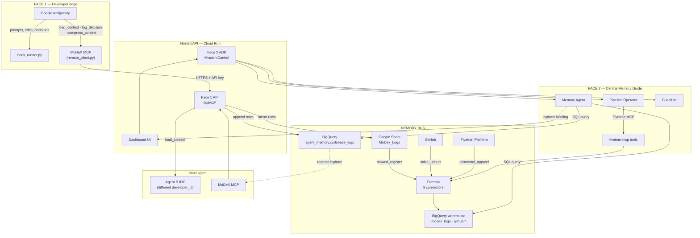
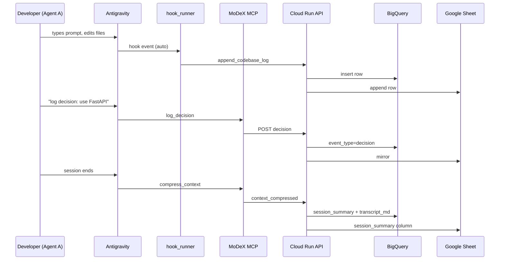
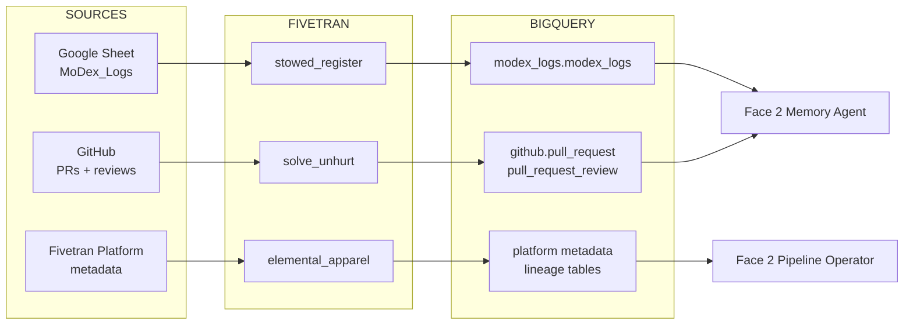
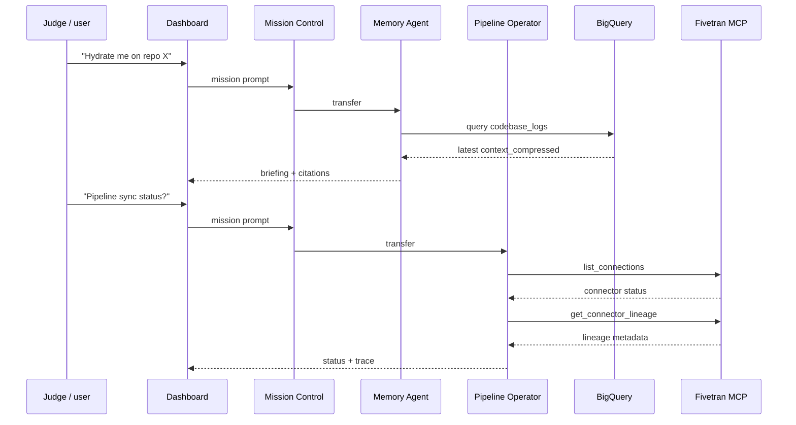
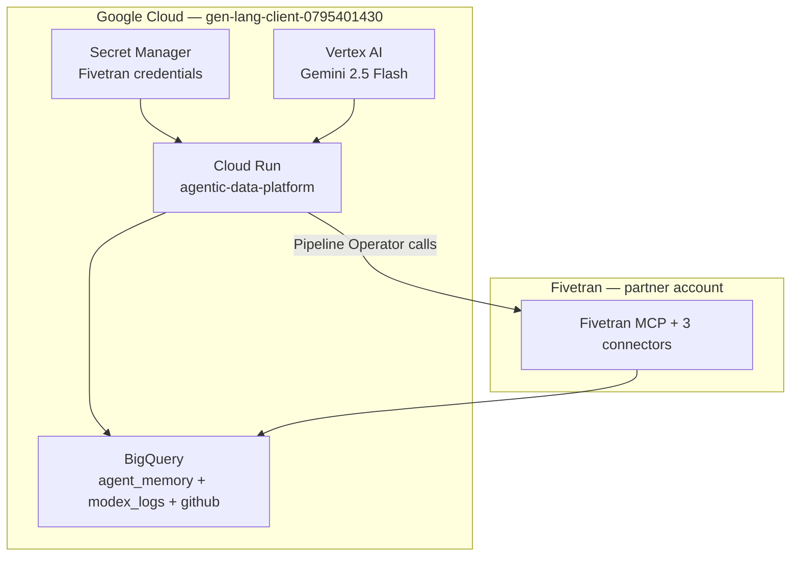

# MoDeX — How Everything Connects

> One page: what talks to what, and in which direction.

---

## 1. Bird's-eye view (two faces, one bus)

---

## 2. Connection table (who connects to whom)

| From | To | Protocol / tool | What flows |
|------|-----|-----------------|------------|
| **Developer IDE** | `hook_runner.py` | Antigravity hooks | Raw IDE events (prompt, file edit, stop) |
| **Developer IDE** | **MoDeX MCP** | MCP over stdio | `load_context`, `log_decision`, `compress_context` |
| **MoDeX MCP** | **Cloud Run Face 1 API** | HTTPS + Bearer `msk-*` | JSON logs, decisions, session compress |
| **Face 1 API** | **BigQuery** | Streaming insert | `agent_memory.codebase_logs` rows |
| **Face 1 API** | **Google Sheet** | Sheets API | Human-readable mirror (`MoDex_Logs` tab) |
| **Google Sheet** | **Fivetran** | Connector `stowed_register` | Sheet → warehouse sync |
| **GitHub** | **Fivetran** | Connector `solve_unhurt` | PRs + reviews → `github.*` tables |
| **Fivetran Platform** | **Fivetran** | Connector `elemental_apparel` | Lineage + metadata → BigQuery |
| **Fivetran** | **BigQuery** | Managed sync | `modex_logs.modex_logs`, `github.*`, metadata |
| **Dashboard user** | **Face 2 ADK** | HTTPS `/api/mission` | Natural-language questions |
| **Mission Control** | **Memory Agent** | ADK transfer | Memory / hydrate / why questions |
| **Mission Control** | **Pipeline Operator** | ADK transfer | Pipeline health, sync, lineage |
| **Mission Control** | **Guardian** | ADK transfer | Approve writes (sync, export) |
| **Memory Agent** | **BigQuery** | SQL | Read `codebase_logs`, GitHub tables |
| **Pipeline Operator** | **Fivetran MCP** | MCP tools | `list_connections`, `sync_connection`, `get_connector_lineage` |
| **Fivetran MCP** | **Fivetran API** | REST (via MCP server) | Live connector ops |
| **Agent B MCP** | **Face 1 API** | `load_context` | Compressed session → IDE system context |
| **Secret Manager** | **Cloud Run** | Runtime injection | Fivetran API key + secret |

---

## 3. Face 1 path (capture) — step by step

---

## 4. Fivetran path (memory bus) — step by step

---

## 5. Face 2 path (answer + operate) — step by step

---

## 6. Agent-to-agent handoff (the demo loop)

```mermaid
flowchart TB
    A["Agent A · PC1 · Antigravity\ndeveloper_id: judge"]
    B["Agent B · PC2 · Antigravity\ndeveloper_id: judge2"]
    REPO["Same GitHub repo\ngithub.com/.../hackathon-demo"]
    MEM["Shared memory slug\nsame project_repo"]

    A -->|"code + git push"| REPO
    A -->|"log_decision · compress_context"| MEM
    MEM -->|"Fivetran sync"| BQ["BigQuery"]
    B -->|"git pull"| REPO
    B -->|"load_context"| MEM
    MEM -->|"decisions + rejected paths"| B

    style A fill:#1a3a5c
    style B fill:#1a4a3c
    style MEM fill:#3a2a1a
```

**Key rule:** Same `project_repo` slug + **different** `developer_id` = shared memory with two authors.

---

## 7. Google Cloud components (what runs where)

---

## 8. One-sentence summary

**Face 1** writes memory from the IDE → **BigQuery + Sheet** → **Fivetran** keeps the warehouse fresh → **Face 2** reads and operates on that bus → **Agent B** loads the same memory via **MCP** and continues where **Agent A** stopped.
